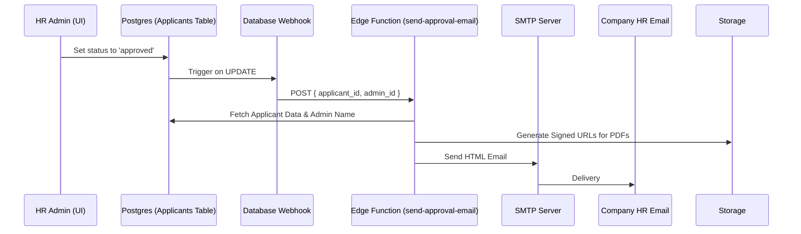

# Proposal: Automated Approval Email Workflow

This plan outlines the implementation of an automated email notification system that triggers whenever an HR Admin approves an applicant.

## 🏗️ Architectural Overview

The most robust approach is using a **Database Webhook** coupled with a **Supabase Edge Function**.



## 📩 Email Template Design

I recommend a premium, professional HTML template that matches the **HR Hub Pro** dark/teal aesthetic (though for emails, a clean light theme often has better compatibility).

### Proposed Template Content:
- **Subject**: `[HR Hub Pro] New Employee Approved: {{Applicant Name}}`
- **Banner**: Teal accent with "Approval Confirmed" heading.
- **Body**:
  > Hello HR Team,
  > 
  > A new applicant has been approved and moved to the employee list. Please find the details and generated documents below:
  >
  | Field | Value |
  | :--- | :--- |
  | **Employee** | {{full_name}} |
  | **Email** | {{email}} |
  | **Approved By** | {{admin_name}} |
  | **Date** | {{date}} |
  >
  > **📄 Documents (Signed PDFs):**
  > - [Pre-Employment Form]({{signed_url_1}})
  > - [Policy Acknowledgment]({{signed_url_2}})
  >
  > *Note: These document links will expire in 7 days for security.*

## 🛠️ Implementation Requirements

### 1. Database Configuration
We need a small SQL snippet to enable the webhook:
```sql
-- Enable the webhook extension
select db_pre_config(); -- Ensure net extension is on

-- Create trigger for approved status
create trigger on_applicant_approved
  after update of status on public.applicants
  for each row
  when (new.status = 'approved' and old.status != 'approved')
  execute function supabase_functions.http_request(
    'https://<project-id>.supabase.co/functions/v1/send-approval-email',
    'POST',
    '{"Content-Type":"application/json", "Authorization":"Bearer <service-key>"}',
    '{}',
    '1000'
  );
```

### 2. Edge Function (`send-approval-email`)
This function will:
1. Receive the `applicant_id`.
2. Generate **Signed URLs** from Supabase Storage (so the files can be opened without logging in).
3. Connect to your **SMTP settings** using `nodemailer` (or similar).
4. Send the HTML email.

### 3. SMTP Settings
You mentioned keeping a dummy account. We will need:
- `SMTP_HOST`, `SMTP_PORT`, `SMTP_USER`, `SMTP_PASS`, and a `FROM_EMAIL`.

---

> [!TIP]
> **Why use Signed URLs instead of Attachments?**
> Sending large PDFs as attachments can sometimes cause emails to be blocked by firewalls or fill up the recipient's inbox. Signed URLs are lightweight, secure, and ensure HR always views the latest version.

**What do you think of this approach? If approved, I can start by drafting the Edge Function code.**
